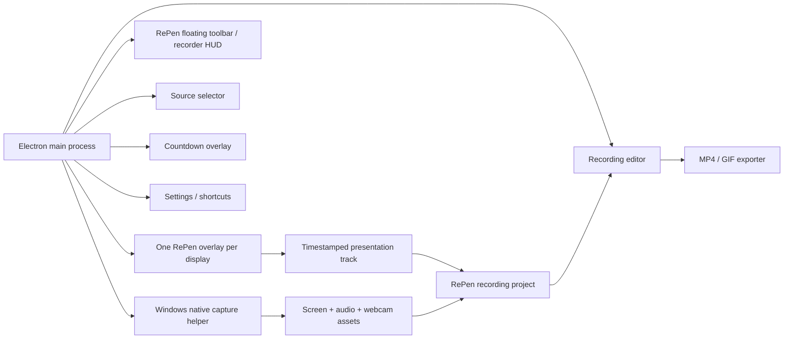

# Integrate full OpenScreen feature set into RePen

Task ID: `20260715-100737-integrate-full-openscreen-feature-set-into-repen`

## Goal

Combine RePen's Windows-first live annotation, presenter, screenshot, and board workflows with the complete user-facing OpenScreen recording and post-production feature set. Deliver one maintainable RePen application in which a user can present and annotate live, record a display or window with audio/webcam/cursor telemetry, edit the result, add captions and visual effects, save a project, and export MP4 or GIF.

This task is currently a planning brief. It does not authorize implementation until the user accepts the architecture and milestone order.

## Current Phase

`implementation`

## Owners

- Planner: `codex`
- Implementer: `antigravity`
- Reviewer: `codex`
- Native Windows reviewer: assign before Phase 3
- Release/QA owner: assign before Phase 10

## Constraints

- Preserve unrelated user changes and all currently working RePen functionality.
- Follow `AGENTS.md` and `.agent-hub/protocol.md`; record every phase transition and material deviation.
- RePen remains the product name, primary interface, and owner of the combined architecture.
- The first combined release targets Windows 10/11. “All OpenScreen features” means all user-facing feature families on Windows. macOS/Linux parity is a separate later program because RePen is explicitly Windows-first.
- Do not claim OpenScreen uses FFmpeg. Its current Windows production route uses a native Windows Graphics Capture helper, WASAPI/Media Foundation, and a browser/WebCodecs-oriented editor/export stack.
- Treat OpenScreen as archived, third-party source—not as an actively supported dependency or background executable.
- Pin the imported OpenScreen baseline to commit `f57e36e25448b5af6c7b1b271066fe5beb9b8a49` (v1.5.0-era source, 2026-06-16) unless a documented review selects a later community-fork commit.
- Preserve the OpenScreen MIT copyright and license notice in distributed copies containing substantial OpenScreen code. Retain RePen's own license for original code and add third-party notices.
- Keep Electron security guarantees: `contextIsolation: true`, `nodeIntegration: false`, minimal/versioned preload APIs, validated IPC payloads, and explicit file access.
- No silent fallback from native Windows capture to a materially different capture path in production. Capability failures must be visible and actionable.
- Recording controls and the editor must never destabilize live overlay input, click-through behavior, screenshots, boards, or multi-monitor support.
- Long recordings must stream to disk; accumulating complete recordings in renderer memory is not acceptable.
- Every phase must leave a launchable, testable application or remain isolated behind a disabled feature flag.
- Generated Graphify reports should be updated only when implementation begins and the normal hooks/scripts require it.
- Repository maintenance issue discovered during planning: `AGENTS.md` documents `npm run agent -- <command>`, but `package.json` currently has no `agent` script. Use `node scripts/agent-hub.js` until separately corrected.

## Context Read

- [x] `AGENTS.md`
- [x] `.agent-hub/protocol.md`
- [x] `.agent-hub/templates/task.md`
- [x] `docs/technical-architecture.md`
- [x] `docs/qa-checklist.md`
- [x] `package.json`
- [x] `main.js`
- [x] `src/preload.js`
- [x] `src/renderer/overlay.html`
- [x] `src/renderer/overlay.js`
- [x] `src/renderer/toolbar.html`
- [x] `src/renderer/toolbar.js`
- [x] Current static verification scripts
- [x] OpenScreen `README.md`, `LICENSE`, and `package.json`
- [x] OpenScreen Electron main/preload/window/IPC structure
- [x] OpenScreen Windows WGC helper and native recorder roadmap
- [x] OpenScreen recording session and project schemas
- [x] OpenScreen recorder hook, editor types, persistence, timeline, captions, and exporter layout
- [x] OpenScreen unit/browser/E2E test layout

## Analysis Summary

### Current RePen baseline

RePen is a working CommonJS Electron application with secure preload isolation and separate overlay, toolbar, and settings windows. It creates an overlay per display, supports click-through switching, global shortcuts, structured annotations, undo/redo, sessions, pages, whiteboard/blackboard/pattern modes, screenshots, PDF export, and presenter tools.

The current implementation is concentrated in several large files:

- `main.js`: approximately 2,579 lines; window lifecycle, application state, scene state, persistence, export, screenshots, shortcuts, and IPC.
- `src/renderer/overlay.js`: approximately 2,373 lines; canvas rendering, pointer interaction, selection, boards, screenshots, and visual effects.
- `src/renderer/toolbar.js`: approximately 1,513 lines; toolbar UI, settings UI, tool routing, and state synchronization.
- `src/renderer/toolbar.css`: approximately 2,302 lines.

This is adequate for the current product but not a safe host for directly pasting OpenScreen's recorder/editor. A modularization and build-system migration must precede feature import.

### OpenScreen baseline

OpenScreen is an archived TypeScript/React/Vite Electron application. Its feature set is distributed across:

- Electron windows and IPC for launcher/HUD, source selection, countdown, editor, projects, streamed recording data, and native capabilities.
- A native Windows helper written in C++ using Windows Graphics Capture, WASAPI, Media Foundation, and a DirectShow webcam fallback.
- `useScreenRecorder` and recording-session contracts for browser/native capture coordination.
- A large React editor with timeline, preview composition, project history, unsaved-change handling, settings, and export dialogs.
- Cursor telemetry and cursor rendering/smoothing/themes.
- Offline speech-to-text captions.
- WebCodecs/media export for MP4 and GIF.

OpenScreen's own documentation states that it is not production grade, and its Windows roadmap still lists hardening work. Imported code must be reviewed and tested, not treated as a drop-in supported library.

### Architecture decision

Use a staged **foundation migration plus selective source import**, not a Git history merge and not a second OpenScreen process.

1. RePen remains one Electron application.
2. Introduce TypeScript, React, Vite, shared contracts, and test tooling while keeping the legacy RePen shell runnable.
3. Import OpenScreen subsystems into RePen-owned modules with provenance recorded.
4. Port RePen's live overlay and toolbar into the new modular shell.
5. Add a timestamped RePen presentation track so live ink, shapes, boards, spotlight, and laser activity can be replayed and exported over both display and window recordings.
6. Retire legacy entry points only after parity tests pass.

### Why a presentation track is required

Recording a display may capture the visible transparent overlay, but recording a single application window will not reliably include RePen because RePen is a separate window. Relying on incidental window composition also makes annotations permanently baked into the pixels and can accidentally record the toolbar.

The combined design therefore records the target media cleanly and records RePen visual activity as time-aligned structured events. Preview and export composite those events later. A compatibility “burned-in display capture” mode may be retained, but it is not the canonical project representation.

## Target Product Experience

### Primary workflows

1. **Present only**
   - Launch RePen into its current floating toolbar and per-display overlay.
   - Draw, highlight, use shapes/text, spotlight/laser, and boards without opening an editor.
   - Retain current screenshot, session, and PDF workflows.

2. **Record and edit**
   - Click Record from the RePen toolbar.
   - Choose a display or window, microphone, system audio, webcam, cursor mode, and countdown.
   - Continue using RePen normally while recording.
   - Pause, resume, restart, cancel, or stop from compact controls/global shortcuts.
   - On stop, open the captured session in the editor with RePen presentation activity aligned to the timeline.
   - Apply all OpenScreen editing features and export MP4/GIF.

3. **Open existing project**
   - Open a RePen recording project from the launcher, recent-project list, Explorer association, or File menu.
   - Resolve moved/missing media with a relink flow.
   - Preserve unsaved-change prompts, autosave/recovery, and schema migrations.

4. **Record without live annotation**
   - Disable the presentation track and use RePen as a polished screen recorder/editor.

### Window model



### Capture-window policy

- Overlay windows: visible to the presenter; their structured visual state is recorded into the presentation track.
- Toolbar, source selector, countdown, settings, dialogs, and recorder controls: excluded from capture where the platform supports exclusion; otherwise positioned outside the chosen source and explicitly tested.
- Selected-window capture: always uses clean media plus presentation-track compositing.
- Display capture: defaults to clean media plus presentation-track compositing; an optional “record exactly what I see” burn-in mode can be added behind a setting.
- Board mode: recorded as structured board background/page/viewport events plus annotations so it remains crisp and editable at export resolution.

## Feature-Parity Contract

The phrase “all OpenScreen features” is complete only when every row below has implementation and verification evidence.

| Feature family | Required combined behavior | Main source area | Verification gate |
| --- | --- | --- | --- |
| Display/window selection | Select a display or ordinary app window; remember last valid source; handle unavailable sources | source selector, native contracts | WGC display and window E2E tests |
| Screen recording | Native Windows capture at supported FPS/resolution with explicit capability errors | WGC helper, recording session | 1/10/30-minute recordings; frame integrity |
| System audio | WASAPI loopback captured and muxed as AAC | WGC helper/audio mixer | system-only fixture and drift check |
| Microphone | Device selection, gain, permission/error handling, mic-only and mixed audio | WGC helper/device hooks | mic-only/mixed/device-unplug tests |
| Webcam | Device selection, PiP, drag position, mirror, size, rectangle/circle/square/rounded masks, reactive zoom where supported | recorder, webcam layout/export | webcam E2E plus preview/export visual comparison |
| Cursor | Editable cursor overlay, cursor themes, size, smoothing, motion blur, click effects, captured/baked option | native cursor bridge, preview/export | cursor position and click-effect E2E |
| Auto/manual zoom | Add/edit zoom regions, depth, duration, easing, precise focus, cursor-follow/auto-focus, suggested auto-zooms | editor timeline/preview | deterministic zoom fixtures and export comparison |
| Backgrounds | Bundled wallpapers, solid colors, gradients, custom images, padding, shadow, rounded corners | settings/compositor | snapshot fixtures for every background class |
| Motion blur | Adjustable motion blur in preview and export | motion smoothing/frame renderer | browser tests and rendered-frame comparison |
| Timeline editing | Scrub/play, zoom timeline, trim/cut regions, per-segment speed, snapping guides, keyframes, waveform | timeline/editor state | unit + browser + interaction E2E |
| Annotations | OpenScreen text, arrow/figure, image and blur annotations, text animation presets | annotation editor/renderer | timeline placement and exported-frame tests |
| RePen live annotations | Pen, calligraphy, highlighter, shapes/arrows, text, eraser, selection, spotlight, laser, boards/pages replayed over media | RePen overlay + presentation track | live-to-preview-to-export parity tests |
| Crop/aspect/resolution | Crop source and export common landscape, portrait, and square aspect ratios/resolutions | crop/layout/export | pixel-dimension assertions |
| Captions | On-device/offline transcription, editable generated captions, timing conversion into annotation regions | captioning worker/model | offline audio fixture and timing checks |
| Export | MP4 with H.264/AAC and GIF with size/FPS/loop settings; progress/cancel/error states | exporter | decode exported files and assert streams/dimensions/duration |
| Projects | New/open/save/save-as, recent project, portable asset references, migrations, unsaved prompts, recovery | project service/persistence | round-trip and corrupt/missing-file tests |
| Shortcuts | Customizable shortcuts with collision detection across presenter, recorder, and editor commands | shortcut context/main registration | registration/collision/persistence tests |
| Localization | Arabic, English, Spanish, French, Italian, Japanese, Korean, Brazilian Portuguese, Russian, Turkish, Vietnamese, Simplified Chinese, Traditional Chinese | i18n resources | key completeness, RTL, overflow smoke tests |
| RePen utility features | Existing tray, auto-start/preferences, multi-monitor overlay, screenshot, clipboard/save, sessions, PDF, board navigation | existing RePen modules | legacy regression suite and manual QA |

## Target Repository Structure

The exact filenames can change during implementation, but subsystem boundaries should remain:

```text
electron/
  main.ts
  bootstrap/
  windows/
    overlayWindow.ts
    toolbarWindow.ts
    sourceSelectorWindow.ts
    countdownWindow.ts
    editorWindow.ts
    settingsWindow.ts
  ipc/
  recording/
  native-bridge/
  native/
    wgc-capture/
src/
  app/
  shared/
    contracts/
    schemas/
    constants/
  presenter/
    overlay/
    toolbar/
    scene/
    tools/
    boards/
    presentation-track/
  recorder/
    launcher/
    source-selector/
    controls/
    hooks/
  editor/
    timeline/
    preview/
    annotations/
    captions/
    projects/
    export/
  settings/
tests/
  unit/
  browser/
  e2e/
docs/
  architecture/
  migration/
  qa/
third_party/
  openscreen/
    LICENSE
    NOTICE.md
```

Avoid preserving OpenScreen's monolithic `VideoEditor.tsx`, `SettingsPanel.tsx`, and `VideoPlayback.tsx` as permanent architecture. They may be imported temporarily to establish parity, but follow-up extraction into the boundaries above is part of completion.

## Core Data Contracts

### Recording state machine

Use one authoritative main-process state machine:

```text
idle -> selecting -> countdown -> starting -> recording
recording <-> paused
recording/paused -> finalizing -> editor-ready
any active state -> cancelling -> idle
any transition -> failed -> recover/idle
```

Every command includes a session ID and expected prior state so duplicate clicks, renderer reloads, or stale IPC cannot start/stop the wrong session.

### Project schema

Create a versioned RePen recording project rather than reusing `.rpen` notebook files:

```ts
interface RePenRecordingProjectV1 {
  schemaVersion: 1;
  projectId: string;
  createdAt: string;
  updatedAt: string;
  source: CaptureSourceDescriptor;
  media: {
    screenVideoPath: string;
    webcamVideoPath?: string;
    nativeSessionPath?: string;
    durationMs: number;
  };
  cursorTrack?: CursorTrack;
  presentationTrack?: PresentationTrack;
  editor: EditorState;
  provenance: {
    appVersion: string;
    platform: string;
    captureBackend: string;
  };
}
```

Use an unambiguous extension such as `.repen-project`; retain `.rpen` for RePen notebook/session files. Do not store large binary media inside JSON. Use a project directory or sidecar asset folder with normalized relative paths and relinking support.

### Presentation track

The presentation track must be deterministic and tied to the same monotonic timing origin as native capture:

```ts
interface PresentationTrack {
  schemaVersion: 1;
  initialScene: PresentationSceneSnapshot;
  events: PresentationEvent[];
}

type PresentationEvent =
  | { timeMs: number; type: 'annotation/add'; annotation: SceneAnnotation }
  | { timeMs: number; type: 'annotation/update'; annotation: SceneAnnotation }
  | { timeMs: number; type: 'annotation/delete'; annotationIds: string[] }
  | { timeMs: number; type: 'scene/clear'; scope: SceneScope }
  | { timeMs: number; type: 'board/change'; board: BoardSnapshot }
  | { timeMs: number; type: 'viewport/change'; viewport: BoardViewport }
  | { timeMs: number; type: 'spotlight/update'; state: SpotlightState }
  | { timeMs: number; type: 'laser/sample'; point: NormalizedPoint };
```

Requirements:

- Record an initial snapshot at actual recording start, not when countdown begins.
- Normalize coordinates to the recorded source/display, with source bounds and DPI captured in metadata.
- Coalesce high-frequency pointer/laser/viewport events without changing visible output.
- Flush events incrementally to a temporary sidecar file to avoid data loss and memory growth.
- Commit media, cursor, and presentation sidecars atomically when finalization succeeds.
- Recover or remove partial sessions deterministically after a crash.
- Replay from snapshots/checkpoints so seeking does not replay a long project from time zero on every frame.

### IPC/native bridge

- Adopt a versioned request/result envelope with stable error codes.
- Validate every payload at the main-process boundary.
- Separate domains: `system`, `project`, `recording`, `cursor`, `presentation`, `settings`, and `export`.
- Use capability queries before showing controls.
- Keep legacy `window.appBridge` only as a compatibility facade during migration; new code consumes typed clients.

## Implementation Plan

### Phase 0 — Approval, source provenance, and reproducible baselines

Objective: make the migration auditable before code is imported.

- [ ] Obtain user approval for this plan and record any scope changes.
- [ ] Create a dedicated implementation branch using the `codex/` prefix when implementation is authorized.
- [ ] Record clean baseline results for `npm test`, `npm start`, screenshot export, `.rpen` save/load, PDF export, boards, and multi-monitor behavior.
- [ ] Capture RePen baseline screenshots/video for later visual regression comparison.
- [ ] Pin the OpenScreen source commit and create `third_party/openscreen/NOTICE.md` listing copied/adapted subsystems and provenance.
- [ ] Add the full OpenScreen MIT license to third-party notices before importing code.
- [ ] Audit every imported runtime dependency and native component license; produce an attribution/SBOM report.
- [ ] Decide whether the community fork contains essential post-archive fixes. If it does, record each selected commit rather than switching to an unpinned branch.
- [ ] Document supported Windows versions, architectures, GPU expectations, codecs, maximum tested resolution/FPS, and required build tools.
- [ ] Define feature flags: `newShell`, `nativeRecorder`, `editor`, `presentationTrack`, `captions`, and `newExporter`.

Exit gate:

- Baseline evidence is stored, licensing is reviewed, source commits are pinned, and implementation can be reverted by disabling flags.

### Phase 1 — TypeScript/React/Vite foundation without feature changes

Objective: establish a host architecture compatible with OpenScreen while keeping legacy RePen runnable.

- [ ] Add TypeScript, Vite, React, ReactDOM, Vitest, Playwright, Biome or the selected formatter/linter, and electron-builder configuration in deliberate commits.
- [ ] Add separate scripts for legacy startup, new-shell development, unit tests, browser tests, E2E tests, native builds, and packaging.
- [ ] Compile the new Electron main/preload code to `dist-electron`; render React surfaces through Vite.
- [ ] Introduce shared typed IPC contracts and a result envelope.
- [ ] Add a typed renderer client and capability API.
- [ ] Wrap existing RePen state/actions behind adapters so the legacy overlay and toolbar still receive the same state.
- [ ] Add logging with session IDs and redaction rules; keep it local by default.
- [ ] Establish test fixtures for time, display descriptors, capture sources, and project paths.
- [ ] Configure packaging to include renderer assets, worker files, model assets, and unpacked native binaries.
- [ ] Keep current CommonJS `main.js` startable until the new shell reproduces its lifecycle.

Exit gate:

- Both legacy and new-shell commands launch; new shell creates a secure test window; typed IPC round-trip, build, test, and package smoke checks pass.

### Phase 2 — Modular Electron shell and window lifecycle

Objective: move lifecycle responsibilities out of the current monolithic main process.

- [ ] Extract preferences, application state, display management, scene/session persistence, shortcuts, export routing, and window creation into services.
- [ ] Implement one window registry responsible for RePen overlays, toolbar/HUD, source selector, countdown, editor, settings, and auxiliary export windows.
- [ ] Preserve one overlay per display, mixed-DPI bounds, display hot-plug handling, always-on-top behavior, and click-through state.
- [ ] Add OpenScreen-style source selector/countdown/editor windows under RePen branding.
- [ ] Add explicit capture-exclusion policy for toolbar, controls, settings, selector, countdown, dialogs, and notifications.
- [ ] Make close/minimize/tray behavior deterministic in presenter, recorder, and editor modes.
- [ ] Centralize global shortcut registration with conflict/error reporting.
- [ ] Preserve the current secure BrowserWindow configuration and navigation/external-link restrictions.
- [ ] Add application lifecycle E2E coverage: cold launch, tray restore, open editor, return to presenter, display reconnect, quit during recording, and crash recovery.

Exit gate:

- The modular shell reproduces existing RePen startup, overlay, toolbar, settings, tray, and shortcut behavior before recording is enabled.

### Phase 3 — Windows native recording core

Objective: port and harden the OpenScreen Windows recording backend as a RePen-owned subsystem.

- [ ] Import the WGC C++ helper, CMake build, helper discovery, and packaging rules with provenance comments/notices.
- [ ] Review the helper for input validation, path quoting, subprocess lifetime, stdout protocol robustness, and partial-file cleanup.
- [ ] Port structured capture-source contracts for displays and HWND-backed windows.
- [ ] Implement native capability probing and explicit missing-helper/unsupported-source errors.
- [ ] Implement display and window capture through WGC.
- [ ] Implement H.264 encoding and MP4 muxing through Media Foundation.
- [ ] Implement WASAPI system loopback, selected microphone input, gain, mixing, timestamp normalization, and AAC encoding.
- [ ] Implement webcam selection with Media Foundation and documented DirectShow fallback.
- [ ] Preserve a separate editable webcam asset if practical; if the first imported helper composites webcam into the primary MP4, record this as temporary debt and do not mark full webcam editing complete.
- [ ] Implement pause, resume, cancel, stop, restart-as-discard/start, helper timeout, process-crash handling, and app-shutdown finalization policy.
- [ ] Stream recording output to disk and write an incremental recording-session manifest.
- [ ] Handle monitor removal, window close/minimize/resize/move, DPI change, device unplug, permission errors, disk-full, and protected-window errors.
- [ ] Do not silently switch Windows production capture to `getDisplayMedia`/`MediaRecorder`; allow an explicit developer diagnostic fallback only.

Exit gate:

- Display and window recording produce valid H.264/AAC MP4 assets with system-only, mic-only, mixed-audio, webcam, pause/resume, cancel, and error-path evidence.
- Ten-minute A/V drift is below one video frame; a 30-minute soak test does not show unbounded memory growth.

### Phase 4 — Recorder controls inside RePen

Objective: expose recording without forcing users into the editor architecture.

- [ ] Add a Record button and clear idle/countdown/recording/paused/finalizing states to the RePen toolbar.
- [ ] Add source, microphone, system-audio, webcam, cursor-mode, countdown, quality/FPS, and destination controls.
- [ ] Add a compact recording HUD with elapsed time, pause/resume, restart, stop, cancel, and audio level indication.
- [ ] Add customizable shortcuts for open recorder, start/stop, pause/resume, and cancel.
- [ ] Disable or explain invalid actions while finalization is in progress.
- [ ] Provide visible errors for unavailable devices, helper failures, permission failures, and disk problems.
- [ ] Ensure drawing tools remain immediately usable while recording and recorder controls do not steal overlay input unexpectedly.
- [ ] Restore the exact pre-recording overlay/tool/pass-through state after cancel or stop.

Exit gate:

- A user can record a display/window with audio/webcam from the RePen toolbar while continuing to annotate, with deterministic controls and no regression in pointer routing.

### Phase 5 — Port and modularize the RePen presenter engine

Objective: make RePen's unique functionality a first-class module in the new shell.

- [ ] Define typed scene unions for strokes, highlighter/calligraphy, shapes/arrows, text, images, boards, and ephemeral presenter effects.
- [ ] Extract geometry, eraser hit-testing, history transactions, selection transforms, rendering, and persistence into testable modules.
- [ ] Port the overlay renderer without changing visual behavior first; migrate UI to React only where it improves state ownership.
- [ ] Port the toolbar/settings UI with current compact grouping, orientation, colors, stroke controls, and attached settings.
- [ ] Preserve transparent/pass-through, pen/highlighter/calligraphy, eraser, shapes/arrows, text, selection/move, spotlight, laser, click halo, magnifier, paste-image, undo/redo, clear, and cursor mode.
- [ ] Preserve whiteboard/blackboard/plain/grid/ruled/staff boards, pages, pan/zoom, board colors, save/load, PDF, and screen/annotation export.
- [ ] Preserve `.rpen` schema loading and add migrations rather than breaking existing sessions.
- [ ] Add renderer-level tests for tools, scene history, board/page isolation, multi-display coordinate conversion, and state transitions.

Exit gate:

- The new presenter engine passes the existing automated suite plus an expanded manual QA checklist and can replace the legacy overlay/toolbar behind a feature flag.

### Phase 6 — Timestamped RePen presentation track

Objective: make live RePen activity replayable and exportable over any selected source.

- [ ] Create the presentation-track schema, writer, incremental sidecar format, checkpoints, reader, and deterministic reducer.
- [ ] Synchronize the track to the native recording start timestamp and pause/resume timeline.
- [ ] Record the initial scene and board/page/viewport state at recording start.
- [ ] Record annotation add/update/delete/clear events and preserve undo/redo semantics as the resulting visible event stream.
- [ ] Record spotlight and laser samples with throttling/interpolation rules.
- [ ] Record board background, page, pan, and zoom transitions.
- [ ] Store normalized source/display coordinates plus DPI/bounds metadata.
- [ ] Render the track into editor preview at arbitrary timestamps.
- [ ] Add a top-level editor toggle for RePen presentation visibility and per-item timing/visibility controls where feasible.
- [ ] Define capture behavior for annotations outside a selected window's bounds and for multi-monitor display changes.
- [ ] Test pause/resume, seek, undo during recording, clear, page changes, crash recovery, and long sessions.

Exit gate:

- Display and selected-window recordings show the same RePen visuals in editor preview and final export, while toolbar/control windows remain absent.

### Phase 7 — OpenScreen editor foundation and project persistence

Objective: bring the full editing workflow into RePen with stable project storage.

- [ ] Import/adapt OpenScreen editor types, defaults, history, project normalization, and project service.
- [ ] Split editor state by concern: media, layout, timeline, effects, annotations, webcam, cursor, captions, export, and dirty/save status.
- [ ] Port playback controls, scrubbing, frame stepping, keyboard navigation, empty state, dialogs, and unsaved-change flow.
- [ ] Port timeline rows, subrows, clips/items, keyframe markers, snapping, zoom controls, and background waveform.
- [ ] Implement `.repen-project` new/open/save/save-as and recent projects.
- [ ] Store relative asset paths when possible; implement relink for moved/missing media.
- [ ] Add autosave/recovery snapshots and atomic writes.
- [ ] Add explicit migrations from OpenScreen `.openscreen` projects and preserve imported media/editor settings where supported.
- [ ] Keep `.rpen` notebook files separate but allow importing them as a presentation-track/board asset.
- [ ] Refactor imported editor monoliths after parity so no single component remains responsible for most of the editor.

Exit gate:

- A recorded session opens, edits, saves, closes, reopens, relinks moved media, and recovers from an interrupted save without losing the original media.

### Phase 8 — Full visual editing parity

Objective: implement every OpenScreen preview/edit feature with preview/export consistency.

- [ ] Port crop controls and coordinate transforms.
- [ ] Port aspect ratios, portrait/landscape/square layouts, export resolution choices, padding, border radius, and shadow.
- [ ] Port bundled wallpapers, solid colors, gradients, and custom background images.
- [ ] Port manual zoom regions: start/end, depth, focus point, easing/spring behavior, and pixel-precise positioning.
- [ ] Port automatic zoom suggestions and cursor-follow/auto-focus behavior.
- [ ] Port cursor theme, size, smoothing, motion blur, click effect, and post-recording path editing/smoothing.
- [ ] Resolve OpenScreen's documented Windows native click-bounce backlog with an end-to-end test before marking cursor parity complete.
- [ ] Port global motion blur and ensure deterministic preview/export behavior.
- [ ] Port trim regions, crop, per-segment playback speed, snapping guides, and waveform display.
- [ ] Port text, figure/arrow, image, and blur annotations plus text animation presets.
- [ ] Port webcam PiP positioning, mirror, size, masks, layout presets, and reactive zoom.
- [ ] Add layering rules among source video, background, webcam, cursor, OpenScreen annotations, RePen presentation track, and captions.
- [ ] Add golden-frame tests at representative timestamps for every compositor layer combination.

Exit gate:

- Every visual feature in the parity table can be previewed, saved, reopened, and exported with matching geometry/timing.

### Phase 9 — Offline captions

Objective: preserve OpenScreen's local, offline transcription workflow.

- [ ] Port audio extraction/resampling to mono 16 kHz, demux fallback, leading-silence handling, transcription worker, and caption-to-annotation conversion.
- [ ] Package model/runtime assets correctly and document their installed/download size.
- [ ] Decide whether models ship with the installer or are an explicit optional local download; no background network behavior without consent.
- [ ] Provide progress, cancel, retry, unsupported-language, no-audio, and out-of-memory handling.
- [ ] Allow caption text/timing/style edits after generation.
- [ ] Verify captions work offline after installation and survive project save/load.
- [ ] Add representative speech fixtures without shipping sensitive recordings.

Exit gate:

- A recording with voice audio generates editable timed captions with the network disabled, and preview/export timing matches.

### Phase 10 — MP4/GIF export pipeline

Objective: produce reliable exports for all combined compositor layers.

- [ ] Port/adapt streaming decode, frame rendering, timestamp queues, video encoding, audio encoding, muxing, GIF rendering, webcam frame drawing, annotation rendering, and progress reporting.
- [ ] Compose in a single documented order: background -> source crop/layout -> webcam -> OpenScreen effects/annotations -> RePen presentation track -> cursor -> captions (final order subject to product review).
- [ ] Preserve source audio through trims/speed changes and maintain A/V sync.
- [ ] Support MP4 H.264/AAC quality presets and GIF FPS/size/loop settings.
- [ ] Support all exposed aspect ratios and resolutions without stretching or clipping.
- [ ] Implement export cancellation and partial-file cleanup.
- [ ] Detect unsupported WebCodecs/GPU paths and show an explicit error or controlled software path.
- [ ] Bound decoder/encoder queues and memory use for 4K/long projects.
- [ ] Decode exported files in tests and assert dimensions, duration, video codec, audio codec, frame count tolerance, and expected streams.

Exit gate:

- MP4/GIF exports pass technical stream validation and golden-frame comparison for source, webcam, cursor, captions, OpenScreen annotations, and RePen presentation content.

### Phase 11 — Shortcuts, localization, accessibility, and product polish

Objective: complete the user-facing breadth of OpenScreen without losing RePen clarity.

- [ ] Merge RePen and OpenScreen command registries; define scopes for global presenter/recorder shortcuts and editor-local shortcuts.
- [ ] Add conflict detection, failed-registration messages, reset defaults, and migration from current RePen settings.
- [ ] Port all OpenScreen locale resources and add translations for RePen-only controls in each supported language.
- [ ] Verify Arabic RTL layout, long German-like expansion using pseudolocalization if German is not shipped, CJK font fallback, and toolbar/editor overflow.
- [ ] Add accessible names, focus order, keyboard operation, visible focus, reduced-motion behavior, and screen-reader announcements for recording state/progress.
- [ ] Ensure record/pause/stop state is distinguishable without relying only on color.
- [ ] Add first-run guidance and contextual help for present-only versus record-and-edit workflows.
- [ ] Keep advanced controls progressively disclosed so the compact RePen toolbar remains usable.

Exit gate:

- Translation completeness tests pass, core flows are keyboard operable, recording state is announced, and all supported locales complete a smoke pass.

### Phase 12 — Windows packaging, hardening, and release

Objective: ship a supportable combined application.

- [ ] Package native helper binaries outside `app.asar` for each supported Windows architecture.
- [ ] Verify CMake/MSVC build reproducibility in CI and pin toolchain versions.
- [ ] Produce signed NSIS and portable builds, checksums, SBOM, MIT notices, and release notes.
- [ ] Add CI jobs for static/unit tests, browser tests, Electron E2E, native helper build/smoke, packaging inspection, and artifact validation.
- [ ] Run Windows 10/11 tests across 100/125/150/200% DPI, single/multi-monitor, 1080p/1440p/4K, mixed refresh rates, and monitor hot-plug.
- [ ] Test common microphones, default/changed audio endpoints, webcams, virtual cameras, device unplug, no-device systems, and privacy permission denial.
- [ ] Test long recordings, low disk, non-ASCII/long paths, crash/restart, sleep/wake, lock/unlock, app/window close, protected content, and GPU reset.
- [ ] Measure startup, overlay draw latency, recorder CPU/GPU, dropped frames, export speed, peak memory, installer size, and captions model size.
- [ ] Add local diagnostic bundle export with explicit user consent and redaction.
- [ ] Ship in stages: internal dogfood -> opt-in alpha -> beta -> stable. Keep the legacy presenter path available during alpha/beta until parity is proven.
- [ ] Document rollback, project backup, known limitations, and support triage.

Exit gate:

- Release checklist passes with no critical data-loss, capture, export, security, or overlay-input defects; rollback and migration are tested.

### Phase 13 — Optional cross-platform parity program

This phase is not required for the first Windows-first combined release, but is required if “all OpenScreen features” is interpreted to include all OpenScreen-supported operating systems.

- [ ] Port/harden the macOS ScreenCaptureKit/Swift helper, permissions, cursor accessibility helper, signing, notarization, and audio-version behavior.
- [ ] Implement Linux PipeWire/browser capture behavior and document cursor limitations.
- [ ] Verify the RePen transparent overlay/click-through/window lifecycle on macOS and major Linux desktop environments.
- [ ] Build/sign/notarize/package DMG, AppImage, DEB, PACMAN, and optional Nix artifacts.
- [ ] Repeat the feature-parity and QA matrix per platform; capability-gate real platform limitations.

## Recommended Pull-Request Sequence

Each item should be independently reviewable and keep disabled/incomplete features behind flags.

1. Tooling, TypeScript/Vite shell, and typed IPC scaffold.
2. Modular window registry and app lifecycle.
3. Preferences/shortcut/display services extracted from legacy main.
4. OpenScreen license/provenance plus WGC helper import and build-only CI.
5. Native display capture with video-only smoke test.
6. Native window capture and source selector.
7. System audio, then microphone/mixing.
8. Webcam capture and editable sidecar decision.
9. Recorder state machine, streamed storage, pause/resume/cancel/finalize.
10. RePen toolbar Record/HUD controls.
11. Typed RePen scene and presenter module extraction.
12. Presentation-track schema/writer/replay/checkpointing.
13. Editor/project shell and media playback.
14. Timeline, waveform, trim, and speed.
15. Layout/background/crop/aspect-ratio features.
16. Cursor/zoom/motion effects.
17. Webcam editor and annotations/blur/text animation.
18. Offline captions.
19. MP4 exporter, then GIF exporter.
20. Project migration/recovery and OpenScreen project import.
21. Localization/accessibility/help.
22. Native/E2E matrix, packaging, security, and staged release.

## Verification Strategy

### Automated layers

- Static checks: syntax, lint, formatting, DOM/test IDs during transition, IPC contract/schema validation, translation-key completeness, and dependency/license audit.
- Unit tests: scene geometry, erasing, history, project migrations, timing maps, trim/speed transformations, zoom math, cursor smoothing, caption conversion, path normalization, reducer determinism, and error mapping.
- Property tests: project normalization, random presentation-event replay, timestamp monotonicity, coordinate transforms, and crop/layout bounds.
- Browser tests: Canvas, OffscreenCanvas, WebCodecs, MediaRecorder diagnostic path, workers, caption audio processing, preview rendering, MP4/GIF encoding, and golden frames.
- Electron E2E: window lifecycle, source selection, countdown, recorder controls, editor open/save/reload, unsaved prompts, shortcuts, tray, and capture exclusion.
- Native helper tests: display/window, system/mic/mixed audio, webcam/virtual webcam, cursor telemetry, pause/resume, cancel, failure protocol, drift, soak, and packaging location.
- Artifact tests: launch installed builds, inspect packaged helper/assets/licenses, decode exported MP4/GIF, verify codecs/duration/dimensions, and scan for missing files.

### Mandatory manual scenarios

- Present-only regression through the complete existing `docs/qa-checklist.md`.
- Record a display while drawing, highlighting, erasing, using spotlight/laser, changing board pages, and pausing/resuming.
- Record a selected window and confirm RePen visuals appear in preview/export despite being a separate overlay window.
- Confirm toolbar, settings, countdown, and recorder controls do not appear in output.
- Use mixed-DPI multi-monitor setup; move toolbar and target window between displays during relevant tests.
- Record system audio + microphone + webcam for at least ten minutes and inspect sync at start/middle/end.
- Edit cursor, zoom, crop, background, trim, speed, annotations, captions, and webcam; save/reopen and export.
- Generate captions with network disabled.
- Export landscape MP4, portrait MP4, square MP4, and GIF.
- Interrupt recording/export/app process and verify recovery/cleanup.
- Reopen an old `.rpen` notebook and an imported `.openscreen` project.

### Performance budgets to define in Phase 0

Set exact hardware tiers before implementation. At minimum measure:

- Overlay input-to-pixel latency while idle and while recording.
- Capture FPS and dropped-frame rate at 1080p60 and 4K30/60 where supported.
- CPU/GPU utilization with screen + system audio + mic + webcam.
- Ten- and thirty-minute memory growth.
- Editor seek latency with presentation checkpoints.
- Preview/export frame consistency.
- Export time and peak memory for a representative ten-minute project.
- Cold start, installer size, and captions model footprint.

## Acceptance Checks

- [ ] The app retains all existing RePen presenter, annotation, screenshot, session, board, PDF, shortcut, tray, settings, and multi-monitor behavior.
- [ ] A Record button in RePen starts a deterministic display/window recording workflow.
- [ ] Windows native recording supports screen/window, system audio, microphone, webcam, editable cursor data, pause/resume/cancel/stop, and explicit failures.
- [ ] RePen live annotations and presenter effects appear correctly in both display and selected-window recordings without capturing the toolbar/controls.
- [ ] The editor provides all OpenScreen feature families listed in the parity contract.
- [ ] Offline captions work without network access after required local assets are installed.
- [ ] Projects save/reopen/migrate/relink/recover without destructive media changes.
- [ ] MP4 exports use valid H.264/AAC streams and GIF exports honor size/FPS/loop settings.
- [ ] Preview and export match within documented rendering tolerances.
- [ ] All supported languages have complete keys and pass layout smoke checks.
- [ ] OpenScreen MIT notices and third-party dependency notices ship with every applicable artifact.
- [ ] Static, unit, browser, Electron E2E, native helper, artifact, and manual QA evidence is recorded.
- [ ] No critical security, data-loss, capture-exclusion, A/V sync, or overlay-input defect remains.
- [ ] Legacy presenter entry points are removed only after new-shell parity and rollback validation.

## Risks

| Risk | Severity | Mitigation / release condition |
| --- | --- | --- |
| Scope becomes a multi-product rewrite | Critical | Enforce phase gates and parity table; do not start editor work before recorder and RePen regressions are stable |
| Archived/non-production-grade upstream code | High | Pin source, review every imported subsystem, own tests and maintenance, selectively take community fixes |
| Direct architectural mismatch | Critical | Migrate foundation first; typed adapters and feature flags; no bulk copy into existing monoliths |
| Native helper build/sign/package failures | Critical | Early build-only PR/CI, pinned MSVC/CMake, unpacked binary inspection, signed-build smoke tests |
| A/V/webcam/cursor timing drift | Critical | One native timing origin, timestamp normalization, drift/soak tests, separate editable tracks only with explicit synchronization |
| Selected-window recordings omit RePen overlay | Critical | Canonical presentation track and compositor; never rely solely on desktop composition |
| Toolbar/controls leak into recordings | High | Capture-exclusion policy plus display/window visual E2E tests |
| Cursor click effect remains broken upstream | High | Treat as incomplete until packaged-app record/preview/export E2E proves visible behavior |
| Long recording/export memory growth | Critical | Disk streaming, bounded queues, incremental sidecars, soak tests, cancellation cleanup |
| Project corruption or missing media | Critical | Versioned schemas, atomic writes, immutable source media, autosave/recovery, relink flow, migration tests |
| Mixed-DPI/multi-monitor coordinate drift | High | Record display/source bounds and scale, normalize coordinates, test heterogeneous displays |
| RePen input latency regresses during recording | Critical | Performance budget, profiling, decouple track writing, batch events, reject release if drawing latency exceeds target |
| Offline caption model inflates installer/resources | Medium | Explicit packaging/download decision, show size, local consent, optional component if needed |
| Third-party license/attribution omission | High | SBOM/license CI and packaged NOTICE inspection |
| Dependency/toolchain bloat and supply-chain risk | High | Import minimal dependencies, pin versions, audit licenses/vulnerabilities, avoid unused OpenScreen UI libraries |
| OpenScreen UI overwhelms RePen toolbar | Medium | Separate Present and Edit surfaces; progressive disclosure; preserve compact toolbar |
| Existing static tests give false confidence | High | Add browser/Electron/native/artifact/manual layers before feature claims |
| Cross-platform expectations expand scope | High | Windows parity is explicit; manage macOS/Linux as Phase 13 with separate acceptance evidence |

## Verification

Planning verification completed on 2026-07-15:

- Read current RePen architecture, QA, package, main/preload, toolbar, overlay, and verification scripts.
- Audited OpenScreen archive commit `f57e36e25448b5af6c7b1b271066fe5beb9b8a49` locally, including native recording docs/source layout, editor/project types, captions, timeline, exporter, and tests.
- Confirmed OpenScreen is MIT licensed and the original repository is archived.
- Confirmed RePen's documented Agent Hub npm script is absent; used `node scripts/agent-hub.js` directly.
- Ran `npm test`; all JavaScript syntax, DOM ID, IPC contract, tool-state, scene-separation, eraser-geometry, and dialog-routing checks passed.
- Ran `git diff --check`; it completed without whitespace errors (Git reported only the existing LF-to-CRLF working-copy warnings for Agent Hub state files).
- At planning time no product source code had been changed; implementation began after the user's approval.

Corrective implementation verification completed on 2026-07-15:

- Hardened the modular BrowserWindow foundation, production asset loading, CSP, navigation restrictions, capture exclusion, display readiness, and package contents.
- Reworked the native recorder lifecycle around structured acknowledgements, validated source/device options, non-empty output checks, crash cleanup, packaged-helper discovery, capability probing, and awaited pause/resume/stop/cancel behavior.
- Added a durable versioned presentation-track schema with source/DPI metadata, monotonic sequencing, checkpoints, replay/seek support, buffered writes, surfaced failures, and awaited finalization/discard.
- Connected the legacy RePen runtime to authoritative scene diffs, presentation samples, recorder state broadcasts, source validation, content protection, native crash handling, and app-shutdown cleanup.
- Replaced unbounded synchronous renderer file logging with opt-in asynchronous logging capped at 1 MiB. `REPEN_DEBUG_LOG=1` enables it for diagnostics.
- Restored the documented `npm run agent -- <command>` workflow and made `npm start` compile Electron services before launching from a clean checkout.
- `npm test` passed all legacy checks and 13 Vitest files / 45 unit tests; `npm run electron:build`, `npm run build:all`, and `git diff --check` passed.
- `electron-builder 26.15.3 --win --dir` passed. The unpacked app contains the WGC and cursor helpers outside ASAR, all six renderer entry pages, recorder/presentation services, and both packaged OpenScreen notices.
- A prior `start:new` launch smoke passed. Live screen/microphone/system-audio/webcam capture and long-duration A/V synchronization were deliberately not exercised because they would capture user content and require hardware-aware manual QA.
- This corrective pass stabilizes the implemented foundation/recorder/presentation-track slice. It does not claim completion of the later full OpenScreen editor, captions, export, updater, localization, CI, accessibility, or cross-platform phases.

Recorder-toolbar lifecycle correction completed on 2026-07-15:

- Reproduced the visible packaged toolbar and traced start/stop/discard failures to input routing: starting a recording explicitly hid `#penBar`, and `.recording-hud` was absent from the hover-interactive regions, causing Electron to restore click-through while the HUD was visible.
- The full RePen toolbar now remains visible beside the recording HUD. Active recorder phases force the protected toolbar window visible, topmost, and mouse-interactive; stop and discard remain clickable even when pointer-leave events occur during state transitions.
- The modular shell applies the same visible/topmost/interactive policy during active recording phases.
- Added `tests/unit/recordingToolbar.test.ts` to prevent reintroducing toolbar hiding or click-through recorder controls.
- `npm test` passed 14 files / 48 tests; `npm run electron:build`, `npm run build:all`, Windows unpacked packaging, and `git diff --check` passed.
- A real packaged-helper display smoke test with audio/webcam disabled emitted `recording-started` and `recording-stopped`, exited with code 0, and produced a non-empty 963,795-byte MP4. The temporary test recording was removed afterward.

## Handoff Notes

- This plan intentionally chooses a staged RePen-owned integration, not launching an OpenScreen executable and not merging unrelated Git histories.
- The critical technical concept is the timestamped presentation track. It is what makes RePen annotations work consistently for both display and selected-window capture and keeps them editable.
- Begin implementation only after user approval, starting with Phase 0 and Phase 1. Do not start by copying the editor or adding a toolbar button to an unstructured recorder.
- Antigravity is the default implementer under repository policy; it should declare the start of each implementation phase in `.agent-hub/messages.jsonl` and hand non-trivial architecture/native changes back to Codex for review.
- Any deviation from native Windows capture, project schema separation, capture exclusion, or presentation-track design requires an explicit task-plan update before implementation.
