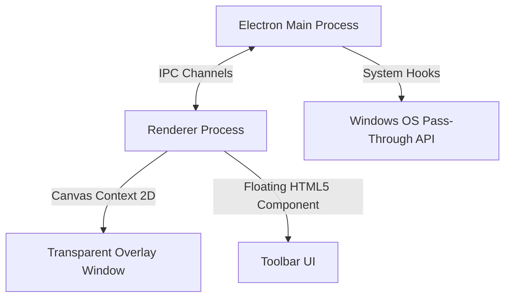

<p align="center">
  
</p>

<h1 align="center">RePen</h1>

<p align="center">
  <b>A free, lightweight, and modern screen annotation and presentation overlay for Windows.</b>
</p>

<p align="center">
  <a href="https://rehmanahmad.pro/software/repen">
    
  </a>
  <a href="https://github.com/iRehmanAhmad/RePen/releases">
    
  </a>
  <a href="https://rehmanahmad.pro/software/repen">
    
  </a>
</p>

---

## 🚀 Overview

**RePen** allows you to draw, highlight, write, zoom, and present directly on top of any active Windows application. Designed specifically for educators, presenters, software developers, remote support, and content creators, RePen provides instant, lag-free canvas drawing without forcing you to switch windows or interrupt your live presentation workflow.

---

## ✨ Features

* 🖋️ **Annotation Tools**: Draw with a freehand pen, calligraphy pen, or high-contrast highlighter.
* 🔦 **Presenter Focus**: Keep your audience engaged using the spotlight, live laser pointer, magnifier, and arrow markers.
* 📝 **Desktop Notes**: Insert rich text notes directly onto the transparent overlay.
* 📐 **Smart Shapes**: Instantly draw straight lines, rectangles, circles, and coordinate grids.
* 🖼️ **Multi-Page Boards**: Switch between whiteboard, blackboard, ruled, grid, and music staff backgrounds.
* 💾 **Session Control**: Save and reload drawing sessions (`.rpen`) or export your multi-page notes directly to PDF.
* 💻 **Pass-Through Toggle**: Instantly switch between drawing mode and normal desktop interaction with a single keypress.

---

## 📸 Screenshots

*Ensure to place your screenshots inside [`docs/screenshots/`](./docs/screenshots/) to display them here:*

<p align="center">
  <br>
  <i>1. Toolbar UI Overlay on Desktop</i>
</p>

<p align="center">
  <br>
  <i>2. Live Demo of Pen, Shapes, and Laser Pointer</i>
</p>

<p align="center">
  <br>
  <i>3. Blackboard, Grid, and Presentation Board Modes</i>
</p>

---

## ⚙️ Technical Architecture

RePen is engineered with **Electron**, combining low-overhead system hooks with high-performance hardware-accelerated canvas overlays.



* **Pass-Through Layering**: RePen toggles transparency and click events on the OS layer, enabling seamless transitions between mouse clicks interacting with the underlying applications and draw commands captured by the HTML5 canvas.
* **State Persistence**: Canvas strokes are serialized into structured JSON objects within `.rpen` files, allowing complete multi-page state preservation.

---

## ⌨️ Keyboard Shortcuts

RePen is designed to be operated entirely using hotkeys so you never have to break your presentation flow.

| Shortcut | Action |
| :--- | :--- |
| `Ctrl + Shift + P` | Toggle Pass-Through Mode (Click on background apps) |
| `Ctrl + Alt + H` | Show / Hide Drawing Toolbar |
| `Ctrl + Alt + N` | Add a New Whiteboard/Notebook page |
| `Ctrl + Alt + S` | Save Drawing Session (`.rpen`) |
| `Ctrl + Alt + O` | Open Saved Session |
| `Ctrl + Alt + E` | Export Current Session to PDF |
| `Ctrl + Alt + ⬅️` | Previous Page |
| `Ctrl + Alt + ➡️` | Next Page (Or create a new page) |

---

## 🛠️ Installation & Running from Source

### Prerequisites
* [Node.js](https://nodejs.org/) v22 or newer
* npm (Node Package Manager)
* Windows 10 / 11 OS

### Run Locally
Clone this repository and launch the app in development mode:
```bash
# Clone the repository
git clone https://github.com/iRehmanAhmad/RePen.git
cd RePen

# Install dependencies
npm install

# Run the application
npm start
```

### Build & Package
To package the app into a standalone Windows executable (`installer .exe` and `portable .exe`):
```bash
npm run dist
```
Standalone packages will be output to the [`dist/`](./dist) directory.

---

## 🤝 Feedback & Support

* **Official Website**: [rehmanahmad.pro/software/repen](https://rehmanahmad.pro/software/repen)
* **Bug Reports & Feature Requests**: [GitHub Issues](https://github.com/iRehmanAhmad/RePen/issues)
* **Releases & Changelogs**: [GitHub Releases](https://github.com/iRehmanAhmad/RePen/releases)

---

<p align="center">
  Designed and developed with ❤️ by <a href="https://github.com/iRehmanAhmad">Rehman Ahmad Chaudhry</a>.
</p>
